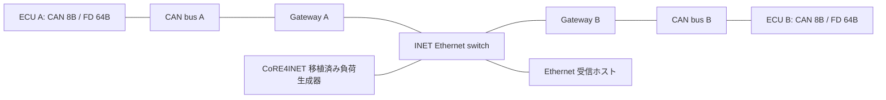

# CAN-CANFD-LIB

**動作確認済みのOMNeT++に、CAN／CAN-FDとEthernetの混在シミュレーション環境を追加するリポジトリです。** INETとCoRE関連ソースを固定コミットで取得し、公開パッチを適用してビルドします。バイナリやOMNeT++本体は含みません。

対象は **OMNeT++ 6.4.0 / INET 4.7.0 / Linux・WSL2**。通常のセットアップは既存OMNeT++の設定・ソース・ビルド成果物を変更せず、管理者権限も使いません。INETやCoRE関連ライブラリが未導入の状態から実行できます。

**対応範囲:** CAN本体の **FiCo4OMNeT** をCAN-FD対応に改修し、SignalsAndGatewaysをINET4へ接続しています。CAN/CAN-FDのEthernet転送は、独自ヘッダに加えて **IEEE 1722 AVTP**（NTSCF/TSCF + ACF CAN/CAN Brief、EtherType 0x22F0）に対応します（[詳細](docs/AVTP.md)）。CoRE4INETは既存 `BGTrafficSourceApp` の選択移植です。旧CoRE4INET全体の移植ではなく、AS6802/TTEthernet、旧AVB/SRP、旧Qbv等は未移植です。CAN-FDの時間計算はイベント単位の近似です。[詳細](docs/CORE_PORT.md)

## Claude Codeにセットアップを依頼する

このリポジトリをcloneしたフォルダでClaude Codeを起動し、以下を依頼してください。`/path/to/omnetpp-6.4.0` は実際のインストール先に置き換えてください。

```text
README.mdとCLAUDE.mdを読み、このリポジトリのセットアップと動作確認を完了してください。
OMNeT++は /path/to/omnetpp-6.4.0 にインストール済みで、標準サンプルの実行まで確認済みです。
既存OMNeT++を再インストール・再設定・再ビルドせず、その環境を使ってください。
まず scripts/doctor.sh で確認し、OMNETPP_ROOTを指定して scripts/setup.sh を実行してください。
INETと各CoREソースの取得、パッチ適用、releaseビルド、CAN単体テスト、混在4構成のテストまで行ってください。
不足する前提条件や非対応バージョンがあれば、既存環境を書き換えず具体的に報告してください。
最後に結果ファイル、GUI/CLI起動方法、対応範囲と未対応事項を報告してください。
```

`CLAUDE.md`はエージェント用の短い実行方針です。導入に必要な情報はこのREADMEにも記載しています。

## 前提条件

| 項目 | 条件 |
|---|---|
| OS | Ubuntu 24.04 x86_64 / WSL2で検証。その他Linuxは未検証。Windowsネイティブ・macOSはセットアップ対象外 |
| OMNeT++ | **6.4.0**、release共有ライブラリがビルド済み。`setenv` と `Makefile.inc` がある開発用インストール |
| ツール | Bash、Git、GNU make、Python **3.10以上**、そのOMNeT++を構築したC++コンパイラ（g++またはclang++等）、AVTP試験用のCコンパイラ（`cc`/gcc/clang） |
| OMNeT++ツール | `opp_run`、`opp_makemake`、`opp_msgc`。標準サンプルが実行でき、モデルをコンパイルできる環境 |
| 通信 | GitHubから公開ソースを取得できること。GitHubアカウントやトークンは不要 |
| 容量・メモリ | 空きディスク目安5GB以上。並列数は既定4。メモリが少ない場合は `BUILD_JOBS=2` または1 |
| GUI（任意） | Qtenvがビルド済みで、X11/WaylandまたはWSLgが利用可能。CLIテストにGUIは不要 |
| パス | リポジトリとOMNeT++のパスに空白を含めないこと |

INET等は事前インストール不要です。検証した組合せを固定しているため、別バージョンのOMNeT++では事前確認で停止します。既存OMNeT++が専用シェル・venv等を必要とする場合は、その標準の起動方法で環境を有効にしてから以下を実行してください。

## 導入手順

```bash
git clone https://github.com/hideki-ozu/CAN-CANFD-LIB.git
cd CAN-CANFD-LIB

# 自分のインストール先を指定。必要なら先にその環境のsetenvをsourceする。
export OMNETPP_ROOT=/path/to/omnetpp-6.4.0
./scripts/doctor.sh

# 取得・パッチ適用・INET/ライブラリ構築・テストを一括実行
mkdir -p logs
set -o pipefail
BUILD_JOBS=4 ./scripts/setup.sh 2>&1 | tee logs/setup.log
```

既にOMNeT++の `setenv` をsource済みの場合は、その環境からインストール先を検出できます。複数のインストールがある場合は `OMNETPP_ROOT` を明示してください。

セットアップは次の順に実行します。

1. バージョン、共有ライブラリ構成、コンパイラ、必要コマンド、`opp_run` の実行を確認。
2. `sources.lock.json` のコミットでINET、FiCo4OMNeT、CoRE4INET、SignalsAndGateways、Open1722（AVTP試験専用の参照デコーダ。シミュレーションにはリンクしない）を `upstream/` に取得。
3. `patches/` の改修を適用。適用済みなら再適用せず、異なるコミットや競合する変更があれば停止。
4. INETと3つの改修ライブラリを **MODE=release** でビルド。
5. CAN単体の15項目、混在ネットワーク4構成、IEEE 1722 AVTPの検証（自己試験33項目・9構成（TSN・gPTPを含む）・pcap/Open1722照合・異常系4件）を実行。

使用したOMNeT++のパスは、Git管理外の `.local/omnetpp-root` に保存します。次の端末でも起動スクリプトが参照します。`OMNETPP_ROOT` の明示指定が最優先です。

通常の導入に `sudo`、`apt-get`、`uv` は不要です。`scripts/build-runtime.sh` と `scripts/setup-runtime-deps.sh` は開発時に用意した任意のローカルランタイム構築用で、**通常のセットアップからは呼びません**。

## 成功の確認と起動

セットアップが終了コード0で終わり、最後に `Setup and validation passed` と表示されれば完了です。バージョン表示やビルド成功だけでは完了扱いにしません。

```bash
./scripts/run-mixed.sh Mixed       # CLIで100msのシミュレーション
./scripts/run-gui.sh Mixed         # Qtenvを開く。Runボタンで開始
./scripts/run-mixed.sh AvtpTscf    # IEEE 1722 TSCFでCAN/CAN-FDを転送
make test                         # 動作確認を再実行（AVTPのみは make test-avtp）
```

| 設定 | 内容 |
|---|---|
| `Mixed` | Classical CAN 8BとCAN-FD 64B、BRS有効 |
| `Classic` | Classical CAN 8Bのみ |
| `FdNoBrs` | CAN-FDのBRS無効 |
| `LoadedEthernet` | 混在通信に約75MbpsのEthernet負荷を追加 |
| `AvtpNtscf` | IEEE 1722 NTSCF + ACF CAN（message_timestamp付き） |
| `AvtpTscf` | IEEE 1722 TSCF + ACF CAN。受信側は提示時刻（500us後）にCANへ送出 |
| `AvtpBriefAggregated` | NTSCF + ACF CAN Brief。1PDUに2フレームを集約 |
| `AvtpLoadedEthernet` | `AvtpTscf` に約75MbpsのEthernet負荷を追加 |
| `AvtpFdNoBrs` | `AvtpNtscf` でCAN-FDのBRS無効 |
| `AvtpTscfOverload` | TSCFで、スイッチ出力をベストエフォート過負荷にする（TSNなし） |
| `AvtpTsn` | 同じ負荷をINET TSN上で実行。AVTPに802.1Q PCP 3/VID 2、スイッチでクレジットベースシェーパ |
| `AvtpTsnGptp` | `AvtpTsn` + gPTP時刻同期（発振器±50ppm） |
| `AvtpTsnFreeRunning` | 発振器±50ppmで時刻同期なし（比較用） |

例: `./scripts/run-mixed.sh LoadedEthernet`。GUIの例: `./scripts/run-gui.sh FdNoBrs`。

- `results/canfd/report.json`: 15項目すべて `passed: true`、`failures: []`。
- `results/mixed/verification.json`: 4構成で各ゲートウェイが20送信/20受信、各ECUが20受信。ペイロード全バイトも検証。
- `results/mixed/<設定>/`: OMNeT++の `.sca` / `.vec`。
- `results/avtp/report.json`: AVTP自己試験（`failed: 0`）、9構成の送受信・ワイヤ検証、異常系、TSN比較の結果。
- `results/mixed/Avtp*/gatewayA.pcap`・`gatewayB.pcap`: AVTPフレームの記録（ナノ秒精度pcap）。
- `logs/`: 混在テストのログ。CAN単体のログは `results/canfd/`。

BRS無効の64BフレームがBRS有効より遅いこと、11/29bitの仲裁、不正DLCやFD RTRの拒否、旧CAN例も確認します。[検証記録](docs/VALIDATION.md)

Qtenvは2DシミュレーションGUIです。Eclipse IDEのインポートやデバッグビルドの設定は自動化していません。まずこのCLIテストで確認してください。

## トラブルシュート

| 症状 | 対処 |
|---|---|
| `Built OMNeT++ not found` | `OMNETPP_ROOT`を `setenv` のあるインストールルートに指定。`bin/` は指定しない |
| バージョン不一致 | この組合せは6.4.0専用。自動アップグレードはしない。対応するインストールを別途用意して指定 |
| `opp_*` / コンパイラが見つからない | OMNeT++の標準シェル環境を有効にする。実行バイナリだけでなく開発ツールも必要 |
| `Killed` / `cc1plus` が終了 | メモリ不足を確認し、`BUILD_JOBS=1 ./scripts/setup.sh` で再開 |
| パッチ・コミット不一致 | `upstream/<repo>` の差分を確認。作業を消す自動resetはしない。必要なら新しいフォルダへcloneして導入 |
| 共有ライブラリが見つからない | 同じOMNeT++環境を有効にし、直接 `opp_run` ではなく同梱起動スクリプトを使用 |
| Qtプラグイン／画面のエラー | まずCLIを使用。既存OMNeT++のQtenvとDISPLAY/WSLg設定を確認 |
| `Qtenv is not available` | 既存OMNeT++がCLIのみの構成。CLIテストは可能。スクリプトは既存インストールを再構成しない |

ビルド失敗後は同じセットアップコマンドで再開できます。OMNeT++のインストールやコンパイラを切り替える場合は、新しいcloneでビルドし、異なる環境の成果物を混在させないでください。

## ネットワークと設定



- [examples/mixed/MixedCanEthernet.ned](examples/mixed/MixedCanEthernet.ned): 配線、ECU、ゲートウェイ、スイッチ。
- [examples/mixed/omnetpp.ini](examples/mixed/omnetpp.ini): ID、周期、長さ、速度、Ethernet 負荷。
- 公称 CAN 速度500kbps、FD データ速度2Mbps、Ethernet100Mbps。ゲートウェイ変換処理は片側5us。
- CAN フィルタを両側で分け、Ethernet から受け取ったフレームを反射しない構成です。
- 送信IDはA側256/512、B側768/1024。1バス内の2ECUが同時に送信を要求し、ID優先度で仲裁します。
- サンプルの `AuditCanSink` は生成時のバイトパターンを検査します。独自ペイロードの場合は `verifyPattern=false` にしてください。
- FiCo のリスト形式パラメータ `periodicityDataFrames` / `initialDataFrameOffset` は **秒を数値文字列**で指定します。例: `"0.010"`。`"10ms"` は指定しないでください。
- 2.0Bバス上で標準／拡張IDを混在させる場合は、ソースの `identifierFormat="standard"` / `"extended"` を指定します。`"auto"` は旧2.0B設定の拡張形式を維持します。
- CAN-FD の合法長は0～8、12、16、20、24、32、48、64Bです。自動パディングは行わず、不正な長さを拒否します。

## ローカル改修

| clone | 改修内容 |
|---|---|
| `upstream/FiCo4OMNeT` | CAN-FDフィールド、DLC・ID検証、BRS、送受信共通時間計算、11/29bit仲裁、待ち行列、C++17対応 |
| `upstream/CoRE4INET` | 既存BGTrafficSourceAppをINET4 Packet/ChunkとEthernetSocketIoへ移植。`Makefile.inet4` で選択ビルド |
| `upstream/SignalsAndGateways` | 既存CAN側アプリを改修、INET4 FieldsChunkによる双方向ゲートウェイと、IEEE 1722 AVTPゲートウェイ（`src-inet4/.../avtp/`）を追加。`Makefile.inet4` で選択ビルド |
| `upstream/inet` | 公式v4.7.0をビルド。独自のプロトコル改修なし |
| `upstream/Open1722` | 試験専用。改修なし。`tests/avtp/open1722_decode.c` と組み合わせてpcapのAVTPDUを照合 |

元の著作権・ライセンスを各cloneに保持しています。cloneの基準コミットと配布物SHA256は [sources.lock.json](sources.lock.json)、変更は [patches/](patches/) に保存しています。`upstream/` とビルド成果物をルートGitに重複登録せず、パッチから復元する構成です。

## モデルの範囲

- CAN-FDはイベント単位の性能評価モデルです。ビットスタッフィングはFiCo由来の割合近似で、ISO CAN-FDのCRC、固定スタッフビット、サンプルポイント、電気的故障をビット精度で再現しません。規格適合性試験には使えません。
- BRSの公称／データ速度を別々に計算し、送信占有時間と受信完了時間に同じ関数を使用します。
- ClassicalフレームとFDフレームが混在するバスのノードはFDを許容するものとして扱います。旧CAN専用ハードウェアがFDフレームをエラーにする挙動はありません。
- FDのRTR、FDバス上の確率的エラー注入は明示的に拒否します。同一ID・同一形式の複数データ送信元による同時競合も、ビット衝突モデルがないため拒否します。同一送信元の待ち行列は許可します。
- ゲートウェイはデータフレーム用です。CAN ID・FD/BRS・形式・DLC・ペイロード全バイト・生成時刻を保持します。既定の `CanEthernetApp` は24Bの独自シミュレーション用ヘッダで、実機の標準カプセル化仕様ではありません。宣言済みFCSのパケットシミュレーション専用です。
- 標準形式が必要な場合は `AvtpCanGatewayApp`（IEEE 1722 AVTP）を使います。バイト精度のserializerを持ち、計算FCSとPCAP記録に対応します。INETのTSN機能（802.1Qタグ付け、クレジットベースシェーパ、gPTP）と組み合わせて使えます（`AvtpTsn*` 構成）。SRPプロトコル自体は静的設定で代替、ACF CAN v1形式のみです。[docs/AVTP.md](docs/AVTP.md)
- Qtenv 2D表示は動作確認済みです。検証元のOMNeT++ではOSG・組込みPython・scave Pythonバインディングを無効にしていましたが、本リポジトリの通常セットアップは導入先の設定を変更しません。

## 公式情報

2026-09-23に公式リリースとGitHub release APIを確認:

- [OMNeT++ 6.4.0](https://github.com/omnetpp/omnetpp/releases/tag/omnetpp-6.4.0)
- [INET 4.7.0](https://github.com/inet-framework/inet/releases/tag/v4.7.0)
- [CoRE4INET](https://github.com/CoRE-RG/CoRE4INET) / [FiCo4OMNeT](https://github.com/CoRE-RG/FiCo4OMNeT) / [SignalsAndGateways](https://github.com/CoRE-RG/SignalsAndGateways)
- [Bosch CAN FD](https://www.bosch-semiconductors.com/products/ip-modules/can-protocols/can-fd/)
- [COVESA Open1722](https://github.com/COVESA/Open1722)（IEEE 1722参照実装。フィールド配置の照合と試験に使用）

## 開発・再配布

通常の導入・修正後のビルドは `make` または `scripts/build-libraries.sh`、検証は `make test`。`scripts/build-all.sh` もライブラリだけを構築する互換エントリです。

改修ソースは `upstream/` の各clone内にあります。変更後はテストを行い、`python3 scripts/export-patches.py` で配布用パッチを更新します。パッチ・テスト・ドキュメントをコミットし、生成されたソースツリー、バイナリ、結果ファイルはコミットしません。

ライセンスは [LICENSE](LICENSE) と [THIRD_PARTY_NOTICES.md](THIRD_PARTY_NOTICES.md) を参照してください。上流由来の改修は各プロジェクトのライセンスを維持します。OMNeT++本体の利用条件はそのインストールのライセンスに従います。

### OMNeT++も新規構築する開発者向けの任意手順

既存OMNeT++を使う利用者には不要です。Ubuntu 24.04 x86_64、Python3.12以上、`uv`、`apt-get`、`dpkg-deb`、OSの開発ツールが必要です。専用の `tools/omnetpp-6.4.0` と `.local/runtime-deps` を使います。

```bash
python3 scripts/fetch-sources.py --with-omnetpp
./scripts/setup-runtime-deps.sh
BUILD_JOBS=4 ./scripts/build-runtime.sh
export OMNETPP_ROOT="$PWD/tools/omnetpp-6.4.0"
./scripts/setup.sh
```

任意のランタイム構築はディスク・時間を追加で使用し、Ubuntuのパッケージリポジトリへのアクセスも必要です。
