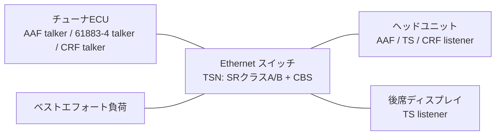

# IEEE 1722 AVストリーム（デジタルラジオ・デジタルTV）

車載のチューナECUからヘッドユニットや後席ディスプレイへ、デジタルラジオ／デジタルTVの音声・映像を **IEEE 1722（AVTP）** で転送するモデルです。次の3つの形式に対応します。

| 形式 | subtype | 用途 | 既定の設定 |
|---|---|---|---|
| **AAF PCM** | 0x02 | デコード済みの音声（ラジオ、TVの音声） | 48kHz、ステレオ、16bit、1PDUに6サンプル（SRクラスA、8000PDU/s） |
| **IEC 61883-4（MPEG-2 TS）** | 0x00（61883/IIDC + CIPヘッダ） | チューナが受信したトランスポートストリームをそのまま転送（ISDB-T・DVB等） | 16Mbit/s、250usごとに最大7ソースパケット（SRクラスB） |
| **CRF** | 0x04 | メディアクロック（音声サンプルクロック）の基準 | 48kHz、160サンプルごとのタイムスタンプを1PDUに6個（50PDU/s） |

実装は `upstream/SignalsAndGateways/src-inet4/signalsandgateways/inet4/avtp/media/`（`patches/SignalsAndGateways.patch`）、例は `examples/av/` です。データは **合成データ** で、内容・連続性・時刻を受信側で検証できるように作っています（実際の放送の録画や音声ファイルは読み込みません）。

## 構成



各ノードのアプリ `AvtpMediaEndpoint`（`IApp`）は、EtherType 0x22F0を1回だけ登録する `AvtpStreamMux` と、任意個の talker／listener からなります（INETは同じプロトコルの二重登録を許さないため）。StandardHost と TsnDevice のどちらでも動きます。時刻は `clockModule` のクロック（gPTPで同期されるTsnDeviceの `clock`）を使い、未指定ならシミュレーション時刻です。

### メディアクロック

talkerは、gPTP時刻に対して `mediaClockPpm`（例では+25ppm。放送波に同期したクロックを想定）だけずれたメディアクロックでデータを作ります。

- AAF: `avtp_timestamp` = 先頭サンプルの取り込み時刻 + `maxTransitTime`（既定2ms）。
- 61883-4: 各ソースパケットヘッダ（SPH、32bit）= そのTSパケットの取り込み時刻 + `maxTransitTime`（既定50ms）。ヘッダの `avtp_timestamp` は先頭ソースパケットと同じ値です。PCRはTSパケット番号 × 2538（27MHz、16Mbit/sで1パケット188B）で、メディアクロックに従います。
- CRF: 160サンプルごとのメディアクロックの時刻 + `timestampOffset`（既定は`maxTransitTime`）。talkerはクロック源なので先のエッジを予測でき、PDUを最初のイベントの時点で送ります。

listenerは、自分のgPTPクロックで提示時刻になった時点でデータを出力（再生）します。

### ワイヤ形式

```text
AAF PCM   | 0x02 | sv ver(3) mr rsv(2) tv | seq | rsv(7) tu | stream_id(64) | avtp_timestamp(32) |
          | format(8) | nsr(4) rsv(2) channels_per_frame(10) | bit_depth(8) |
          | stream_data_length(16) | rsv(3) sp evt(4) | rsv(8) | サンプル（ビッグエンディアン、インタリーブ） |
CRF       | 0x04 | sv ver(3) mr r fs tu | seq | type(8) | stream_id(64) | pull(3) base_frequency(29) |
          | crf_data_length(16) | timestamp_interval(16) | 64bitタイムスタンプ × N |
61883-4   | 0x00 | sv ver(3) mr r gv tv | seq | rsv(7) tu | stream_id(64) | avtp_timestamp(32) | gateway_info(32) |
          | stream_data_length(16) | tag(2)=01 channel(6)=31 | tcode(4)=0xA sy(4)=0 |
   CIP    | 00 SID(6)=63 | DBS=6 | FN(2)=3 QPC(3)=0 SPH=1 rsv(2) | DBC |
          | 10 FMT(6)=0x20 | TSF(1) + 予約(23) |
          | ソースパケット（SPH 4B + TSパケット188B）× N。DBCはソースパケットごとに8増加 |
```

フィールド配置はIEEE 1722-2016の表に従い、AAF・CRFは [COVESA Open1722](https://github.com/COVESA/Open1722) の定義、61883-4は [Wiresharkの IEEE 1722 dissector](https://gitlab.com/wireshark/wireshark/-/blob/master/epan/dissectors/packet-ieee1722.c) と [OpenAvnu](https://github.com/Avnu/OpenAvnu)（`map_mpeg2ts`）の定義と照合しました（いずれもソースはコピーしていません）。

### 合成データ

- **PCM**: チャネルcのサンプルnは ((n + 1000c) × 331) mod 2^bit_depth（2の補数）。値からサンプル番号を逆算できるため、欠落・改変・順序を検出できます。
- **MPEG-2 TS**（ISO/IEC 13818-1）: PAT（PID 0）とPMT（PID 0x1000、番組1、H.264をPID 0x100、AACをPID 0x110）を1000パケットごと（約94ms）、PCRを397パケットごと（約37ms）に映像PIDへ入れます。映像・音声パケットのペイロードは先頭4バイトがパケット番号、残りが (番号 + バイト位置) & 0xFF です。連続性カウンタ（CC）はPIDごと、PAT/PMTはCRC-32/MPEG-2付きの完全なセクションです。

## 使い方

```bash
./scripts/run-av.sh AvTsnGptp        # CLI（1秒間。make run-av）
./scripts/run-av-gui.sh AvTsnGptp    # Qtenv
python3 tests/test_av.py             # AVストリームの検証（make test-av）
```

| 設定 | 内容 |
|---|---|
| `AvBasic` | StandardHost／EthernetSwitch、理想時刻、負荷なし |
| `AvOverload` | ベストエフォートの過負荷（約104%、宛先不明で全ポートへ転送）、TSNなし |
| `AvTsn` | 同じ負荷をINET TSN上で実行。音声とCRFはSRクラスA（PCP 3）、TVはSRクラスB（PCP 2）、VID 2。スイッチは送信クラス5つ（BE、TV、音声、CRF、gPTP）とクレジットベースシェーパ（TV 25Mbps、音声 8Mbps、CRF 1Mbps）、静的マルチキャスト転送（後席にはTVだけ） |
| `AvTsnGptp` | `AvTsn` + gPTP（チューナがグランドマスタ）。発振器はチューナ+50ppm、ヘッドユニット−50ppm、後席+30ppm |
| `AvTsnFreeRunning` | 同じ発振器で時刻同期なし（比較用） |

各実行で `results/av/<設定>/tuner.pcap`・`headUnit.pcap`・`rearDisplay.pcap`（ナノ秒精度のpcap）を記録します。

### 主なパラメータ

| モジュール | パラメータ | 既定値 | 説明 |
|---|---|---|---|
| 共通 | `destAddress` / `listenAddress` | `""` | talkerの宛先／listenerの受信するストリームMAC |
| 共通 | `streamId` / `streamUniqueId` / `listenStreamId` | `""` / `1` / `""` | stream_id（既定: インタフェースMAC << 16 \| streamUniqueId） |
| 共通 | `maxTransitTime` | 2ms（61883-4は50ms） | 提示時刻のオフセット |
| 共通 | `mediaClockPpm` | `0` | talkerのメディアクロックのずれ（gPTP時刻に対して） |
| 共通 | `startTime` / `stopTime` | `10ms` / `-1s` | 送信の開始・終了 |
| 共通 | `latePresentationPolicy` | `play` | 提示時刻に間に合わないデータを `play`（すぐ出力）／`drop` |
| `AafTalker` | `format` / `bitDepth` / `sampleRate` / `channels` / `samplesPerPdu` | `int16` / 容器長 / 48kHz / 2 / 6 | PCMの形式 |
| `Iec61883TsTalker` | `bitrate` / `pduInterval` / `maxSourcePacketsPerPdu` | 16Mbps / 250us / 7 | TSの速度とPDUへの詰め方 |
| `Iec61883TsTalker` | `psiIntervalPackets` / `pcrIntervalPackets` / `audioEveryPackets` | 1000 / 397 / 10 | 合成TSの構成 |
| `CrfTalker` | `baseFrequency` / `pull` / `timestampInterval` / `timestampsPerPdu` / `timestampOffset` | 48kHz / 0 / 160 / 6 / `maxTransitTime` | CRF |

スカラー結果（listener）: `avtpPdusReceived`、`sequenceLost`、`latePresentations`、`droppedStreamId`、`droppedMalformedPdus` など共通の計数に加え、AAFは `samplesPlayed`・`sampleErrors`・`sampleGaps`・`recoveredRatePpm`（タイムスタンプから求めたサンプルレート）・`playoutRatePpm`（実際の再生速度）・`timestampJitterMax`、TSは `tsPacketsOutput`・`continuityErrors`・`psiCrcErrors`（sectionの長さまたはCRCの誤り）・`payloadErrors`・`payloadMissing`（PAT/PMTや映像・音声のPIDなのに必要なペイロードがパケット内にない）・`dbcErrors`・`pcrJitterMax`・`recoveredSystemClockPpm`・`outputSystemClockPpm`、CRFは `recoveredMediaClockPpm`・`regeneratedMediaClockPpm`（再生成したクロックの実速度）・`crfTimestampJitterMax`・`crfLateTimestamps`。talkerは `productionRatePpm` 等（実際の生成速度）。`*RatePpm`・`*ClockPpm` のうち「実際の」値はシミュレーション時刻（物理時間）に対する値です。統計: `presentationError`（listenerの出力時刻 − talkerが意図した提示時刻）、`presentationSlack`、`presentationLateness`。

## 検証（`tests/test_av.py`）

1. **コーデック自己試験（60項目）**: 仕様表から手計算したAAF・CRF・61883-4のバイト列（全フラグ、CIPヘッダ、ソースパケット）とserializer出力の一致、INETでの逆変換、不正PDU 27種の拒否（AES3、ユーザ定義形式（format 0）、チャネル0、ビット長、端数フレーム、長さ超過、sv=0、version、CVF、CRFの長さ・周波数0・予約pull、CIPのtag・channel・tcode・qi・SID・61883-6・DBS・FN・SPH・長さ）、CRC-32/MPEG-2のチェック値、PAT/PMT、PCRの符号化、PCMパターンの往復、不正なTSパケット（ペイロードなしのアダプテーションフィールドのみ、パケット外を指すpointer_field・section_length、4バイト未満のペイロード、CRC誤り、内容の不一致）の分類。
2. **ネットワーク4構成**（理想・TSN・TSN+gPTP・同期なし）: 全listenerで欠落・順序異常・不正PDU・遅延到着・内容の誤り・CC誤り・PSIのCRC誤り・DBC不連続が0。TSは送信済みで提示時刻を過ぎた全パケットを出力、PCRジッタは5ns未満。
3. **メディアクロック**（下表）: タイムスタンプに載る速度は常に+25ppm。実際の生成速度はチューナの発振器分（+50ppm）を加えた+75ppmで、gPTP同期時は全listenerが1ppm以内の速度で再生・出力します。同期なしでは、listenerは自分のクロックで提示するため速度がずれます（ヘッドユニット−25ppm＝生成に対し−100ppm、後席+55ppm）。
4. **ワイヤ検証**（`AvBasic`・`AvTsnGptp`）: チューナのpcapの全PDUを検査します。AAFとCRFは **Open1722参照実装**（`tests/av/open1722_media_decode.c`）と独立のPythonパーサの両方でデコードし、全フィールドの一致、`IsValid`、予約ビット0、連番、サンプル値、タイムスタンプ間隔（メディアクロックどおり、±1ns）を確認します。61883-4はOpen1722に対応がないため、Wireshark・OpenAvnuと同じ配置で書いたPythonパーサで、CIPヘッダの全フィールド、DBC、SPHの間隔、TSのsync・CC・PAT/PMT（CRCと内容）・PCR（値と間隔）・ペイロード・パケット番号の連続を確認します。TSN構成では802.1QタグがPCP 3（音声・CRF）／PCP 2（TV）、VID 2であること、後席にTVだけが届くことを確認します。受信側のpcapは送信側とバイト一致します。
5. **TSNの効果**: `AvOverload` では音声の遅延到着・欠落とTSのCC誤りが起き、`AvTsn` ではすべて0です。
6. **異常系**: stream_id不一致で全PDUを破棄、提示時刻オフセット1us＋`drop` で全PDUを遅延として破棄。

| 構成 | 音声の再生速度 | TVの出力速度（HU／後席） | CRF再生成 | 提示時刻誤差（音声） | 最大伝送時間（音声／TV） |
|---|---:|---:|---:|---:|---:|
| `AvBasic` | +25.0ppm | +25.0／+25.0ppm | +25.0ppm | 0 | 246／362us |
| `AvTsn` | +25.0ppm | +25.0／+25.0ppm | +25.0ppm | 0 | 302／477us |
| `AvTsnGptp`（生成+75.0ppm） | +75.0ppm | +75.1／+75.0ppm | +75.0ppm | −47～+33ns | 309／486us |
| `AvTsnFreeRunning`（生成+75.0ppm） | −25.0ppm | −25.0／+55.0ppm | −25.0ppm | +10～+100us | 287／461us |

最大伝送時間は「提示時刻オフセット − 処理時間 − 最小余裕」で、パケット化の待ち（音声125us、TV最大250us）を含みます。`AvOverload` では音声PDUの75%（5915件）が遅延到着し、807件が欠落しました。

serializerとtalkerを故意に誤らせる変異試験（AAFのnsr位置、CIPのSPHビット位置、DBCの増分、PCR拡張ビット、CRFのpull位置）は、すべて自己試験またはワイヤ検証で検出されます。PCR拡張ビットの誤りは当初見逃していたため（PCR間隔400パケットでは拡張値が常に同じ）、PCR間隔を397パケットにし、自己試験に拡張値の小さいベクタを加えました。

## 未対応事項・前提

- **仕様本文との照合**: フィールド配置は上記の参照実装と照合済みですが、次はIEEE 1722本文と照合していません（**要確認**）。AAFの `avtp_timestamp` を先頭サンプルの提示時刻とする点、61883-4のSPHを各ソースパケットの提示時刻（gPTP nsの下位32bit）とする点（OpenAvnuと同じ扱い）、CRFタイムスタンプに提示時刻オフセットを加える点。
- **データは合成**: 実際の放送TS・音声ファイルの入力はありません。TSは構文上正しいPAT/PMT/PCRを持ちますが、映像・音声のPESやES（H.264、AAC）は中身のない試験パターンです。デコード・画面表示・音声出力のモデルはありません。
- **未対応の形式**: AAFのAES3とユーザ定義形式（format 0。PCMの容器長がないため `AAF_FORMAT_NOT_PCM` として破棄）、sparseタイムスタンプ（`sp`=1）、IEC 61883-6（音声）、CVF（H.264等の圧縮映像）、RVF（非圧縮映像）、IIDC、AVTP over UDP。デジタルラジオはデコード後の音声をAAFで送る想定で、DAB等の放送固有形式（ETI等）はありません。
- **ストリーム管理**: IEEE 1722.1（AVDECC）による発見・接続、MAAP、SRP/MSRPによる帯域予約はありません。宛先MAC・stream_id・スイッチのシェーパとマルチキャスト転送は静的設定です（[AVTP.md](AVTP.md#未対応事項モデルの前提)と同じ）。
- **クロック回復**: listenerは受信したタイムスタンプを自分のgPTPクロック上の時刻としてそのまま使います。PLL等によるメディアクロックの平滑化や、CRFからAAFの再生クロックを生成する連携はありません（CRF listenerは再生成クロックの速度を計算するだけです）。
- **バッファ**: 再生バッファの容量やアンダーラン／オーバーランのモデルはありません。同期なし構成の速度差は、提示時刻誤差の増加と速度の計数で示します。
- シミュレーション時間は1秒です（pcapが約12MB／ノード）。
